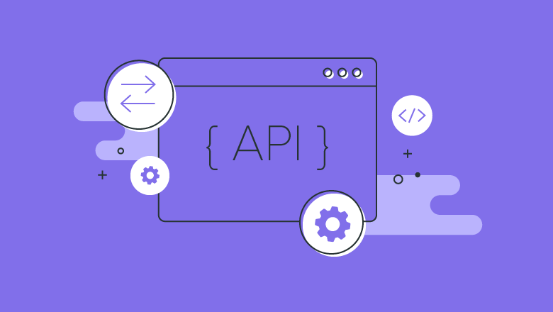

# What is an API?

APIs are mechanisms that allow two software components to communicate with each other using a set of definitions and protocols. For example, the meteorology institute's software system contains daily weather data. The weather app on your phone “talks” to this system through the API and shows you the daily weather updates on your phone.

<figure><figcaption></figcaption></figure>

What does API mean?&#x20;

API stands for "application programming interface." In the context of the API, the word application refers to any software with a distinct function. The interface may be required as a service contract between two applications. This contract defines how they communicate with each other through requests and responses. Their API documentation contains information on how developers should structure those requests and responses.

<figure><figcaption></figcaption></figure>

How do the APIs work?&#x20;

API architecture is often explained in terms of client and server. The application that sends the request is called the client, and the one that sends the response is called the server. In the weather example, the institute's weather database is the server and the mobile app is the client.

APIs can work in four different ways, depending on when and why they were created.

What benefits do REST APIs offer? REST APIs offer four main benefits:

1. Integration APIs are used to integrate new applications with existing software systems. This increases development speed, since you don't have to write every feature from scratch. You can use the APIs to take advantage of existing code.
2. Innovation Entire sectors can change with the arrival of a new application. Businesses must respond quickly and support the rapid implementation of innovative services. To do this, they can make changes to the API without having to rewrite all the code.
3. Expansion APIs present a unique opportunity for companies to meet the needs of their customers across different platforms. For example, the Maps API allows the integration of map information into websites, Android, iOS, etc. Any company can give similar access to their internal databases by using free or paid APIs.
4. Ease of maintenance The API acts as a gateway between two systems. Each system is forced to make internal changes so that the API is not affected. This way, any future changes that one party makes to the code will not affect the other.

<figure><figcaption></figcaption></figure>
