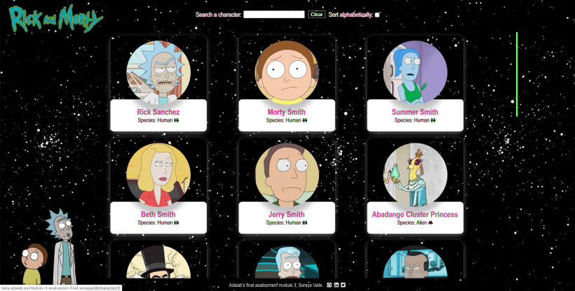
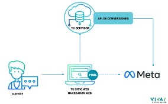

# APIS

## Rick and morty API

The Rick and Morty API is a RESTful and GraphQL API based on the Rick and Morty TV show. You will access data on hundreds of characters, images, locations, and episodes. The Rick and Morty API is full of canonical information as seen on the TV show.

<figure><figcaption></figcaption></figure>

Instead of having to write all the code from scratch, a developer can call an API that will do work they don't want to do and allow them to focus on something they do want to do.

For example, if I need to put an image in a post, I could go out, take several photos, choose one, retouch it, edit it and upload it; or you could download the image from google. Speed and practicality.

The Rick and Morty API is a database about the series of the same name.

Basically the api helps us save development time in which the developer avoids spending time creating something that is already done and simply calls some component included in an api. In the case of the rick and morty api, it only gives a large database with information on different characters divided into the different existing episodes.

and the only thing we do is how we are going to accommodate the different information that is given to us.

## PokeAPI

<figure><figcaption></figcaption></figure>

This is a full RESTful API linked to an extensive database detailing everything about the Pokémon main game series.

It is an api in which, in the same way, it gives us an extensive database with a lot of information related to pokemons, it shows us the name, experience, name, id, type, forms, life, attack, etc...

an application that brings together the complete list of Pokémon, it also allows you to search and view details of the desired characters. Inspired by the Pokédex from the anime Pokémon.

## API Meta-Facebook

<figure><figcaption></figcaption></figure>

It is a tool that allows brands to share data, both online and offline events, directly from their server to Facebook. In this way, advertisers can use the information and data they monitor and record to optimize campaigns and achieve the results they want.

Manage and optimize ads in real time using rule-based ad management. Create custom dashboards: Create dashboards to compare the performance of your Meta ads against ads from other ad channels.

The Conversions API is designed to create a more reliable direct connection between marketing data (from your server, web platform, app or CRM) and Meta. Some examples of marketing data include website events, app events, and offline conversions. That marketing data enables ads to be personalised, optimized and measured on Meta technologies so that they appear to the people who are most likely to find them relevant.

You have several ways to set up the conversions API. Many integrations don't require a developer, and if you use a commerce platform, like Shopify, you can set up the conversions API with just a few clicks. Learn more about how to choose the setup option that's right for your business.

