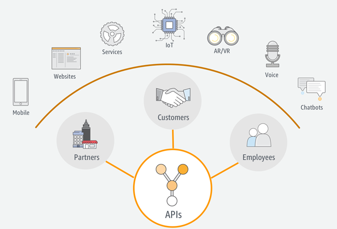

# the importance of using an api

API functions These interfaces are not visible to the public because they are part of the code of an application or a website, they generally use Json language. For this reason, they are present in most of the applications that we use in our daily lives, such as Uber, weather applications, delivery applications, and the like. One way to exemplify what an API is would be with an electrical outlet (outlet). The reason for this example is very easy, because a power outlet allows the user to have access to the electrical system and can connect their appliances through plugs and use them.

In the case of applications, they connect to the API, obtain the information and show it to the user on their device, in an easy and understandable language. A practical example is the following: Uber or Yummy, when displaying the maps, provided by the Google Maps API, allows the user to see where in the city their Uber (or Yummy) is located, and the route that will be traveled during trip. As you can see, you use APIs almost every day.

Basically, the API shows us in a simplified way the different types of information that exist in the development of a web page, thus identifying what elements are necessary within it, such as its design, how the information is entered and a series of components. that appear in the real world that probably cannot be taken into account, for this reason the APIs, being huge databases, can give us a small sample of the amount of information that can be displayed and the different ways of presenting it.

<figure><figcaption></figcaption></figure>
